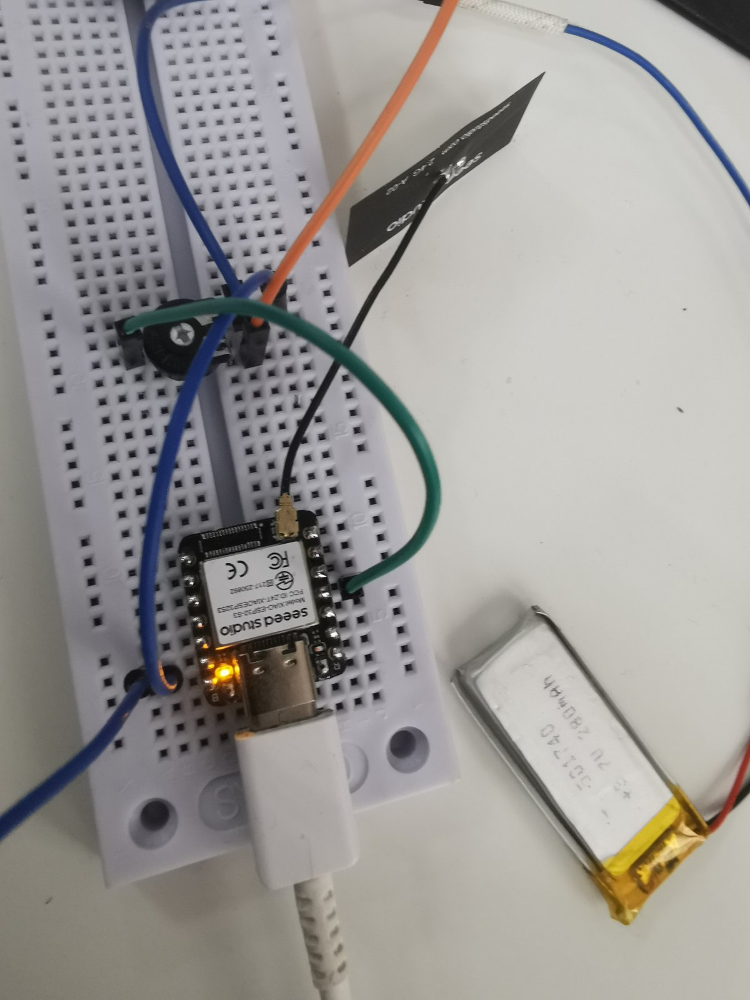

# BTHome v2 Voltage/Battery Sensor Home assistant intergration

This project implements a BLE (Bluetooth Low Energy) sensor device using an ESP32 (or compatible board) that measures voltage via an ADC and advertises the data using the BTHome v2 format. The device provides two sensor readings.
The sensors will automatically appear in HAOS (Home Assistant Operating System)as soon as you enable the BTHome integration.:

1. **Voltage Sensor (Object ID 0x0C):**  
   Reports the measured voltage in millivolts (value sent as two bytes, little-endian). The voltage is constrained to a maximum of 2.5V.

2. **Battery Sensor (Object ID 0x01):**  
   Reports a battery percentage based on the measured voltage. The percentage is calculated with 0V corresponding to 0% and 2.5V corresponding to 100% (sent as a single byte).

## Features

- **ADC Configuration:**  
  The ADC is configured with 12-bit resolution and 11dB attenuation.

- **BLE Advertising:**  
  The sensor readings are encoded using the BTHome v2 format and advertised over BLE. The BTHome header is added only once, followed by each sensor object.

- **Status LED:**  
  An LED connected to the board indicates when an advertisement update occurs.

## How It Works

1. **ADC Voltage Measurement:**  
   The program reads a raw ADC value from a specified ADC pin, converts it to a voltage based on the ADC reference voltage and resolution, and then constrains the value to a maximum of 2.5V.

2. **Data Encoding:**  
   The measured voltage (in millivolts) and a calculated battery percentage are encoded into a single BLE advertisement packet following the BTHome v2 specification:
   - **Voltage Data (ID 0x0C):** Two bytes representing the voltage in millivolts.
   - **Battery Data (ID 0x01):** One byte representing the battery percentage.

3. **BLE Advertisement:**  
   The advertisement packet is updated periodically (every 5000ms) and broadcast over BLE, allowing BTHome-compatible systems to receive and decode the sensor data.
> **Note:** When configured in this way, the sensors will automatically appear in HAOS (Home Assistant Operating System) as soon as you enable the BTHome integration.

## Getting Started

### Prerequisites

- **Hardware:**  
  - ESP32 or similar board with ADC capability.
  - LED connected to the defined LED pin (optional for visual status indication).

- **Software:**
  - Visual Studio Code -> Platformio.ini 
[env:seeed_xiao_esp32s3]
platform = espressif32
board = seeed_xiao_esp32s3
framework = arduino

  - Arduino IDE (or another compatible development environment).
  - BLE library for ESP32 (included with the ESP32 Arduino core).

## Customization

- **Voltage Range:**  
  The `MAX_VOLTAGE` macro limits the measured voltage to 2.5V. Modify this if your application requires a different voltage range.

- **Advertisement Interval:**  
  The `ADV_INTERVAL` macro sets the update interval for BLE advertising. Adjust this value based on your application needs.

- **Calibration:**  
  For enhanced accuracy, you may add calibration parameters (scaling factors and offsets) in the `readVoltage()` function.

